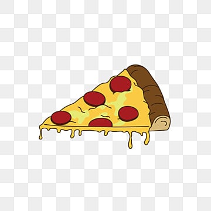

## About the project

a simple pizza ordering website

### Feature requirements

1. User can pay pizza pricd on site
2. User location can be added automatically using GeoLocation
3. add multiple pizzas

### Built with

- React JS
- Tailwind
- react-router

## Demo

## What I've Learnt

1. state management using Redux
2. Reading and Mutating data using react-router loaders and actions
3. Feature based file structure
